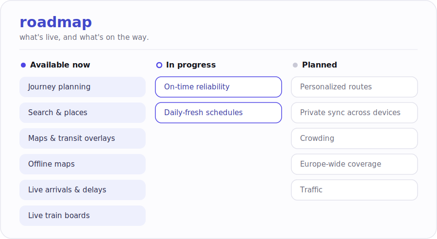

# Roadmap

Where Iter Maps is, and where it's going.

<picture>
  <source media="(prefers-color-scheme: dark)" srcset="docs/assets/roadmap-dark.svg">
  
</picture>

**Available now** — journey planning · search & places · maps & transit overlays · offline maps · live arrivals & delays · live train boards.

**In progress** — on-time reliability · daily-fresh schedules.

**Planned** — personalized routes · private sync across devices · crowding · Europe-wide coverage · traffic.

> The engineering worklist behind each item lives in [`docs/roadmap/`](docs/roadmap/).
